# Project 3: Pathtracer (Part 1)

**Contributors**: Micah Yong (micahtyong@berkeley.edu) and Kevin Li (kevintli@berkeley.edu)

## Overview

In this project, we contribute a physically-based renderer using a path tracing algorithm. Concretely, our contributions take on 5 main parts.
1. In part 1, we perform ray generation and primitive scene intersection. By the end of this part, we were able to generate camera rays, sample rays over a unit pixel, and compute intersections between rays and two primitives: the triangle and sphere. 
2. In part 2, we constructed a bounding volume hierarchy for an input scene using the recursive algorithms outlined in lecture. By the end of this part, we were able to generate a bounding volume hierarchy for a given set of primitives and intersect a ray with the BVH efficiently (i.e., in log time rather than linear time). In this part, it was crucial to keep track of pointers and valid intersection intervals between a ray and bounding box for part 2.2. 
3. In part 3, we implemented direct illumination for both zero-bounce rays and one-bounce rays. To implement one-bounce rays, we constructed two sampling algorithms: Direct lighting with uniform hemisphere sampling and direct lighting with importance sampling. We needed to carefully compute normalization factors and ensure that we operated in the correct coordinate system (either world space or local object space). 
4. In part 4, we implemented global illumination for at-least-one-bounce rays. We used an unbiased method for terminating rays called Russian Roulette. By the end of both parts 3 and 4, we were able to render photorealistic images with complex light scenes. 
5. In part 5, we sped up our pixel-sampling algorithm from part 1 by terminating sampling algorithms that have likely converged already via adaptive sampling. By the end of this part, we could render more noise-free images more efficiently. One bug we faced was regarding floating point errors, where the measure of importance was always equating to zero. To solve this problem, we ensured that all integers were converted to floating point before computing `I`. 

## Part 1: Ray generation and scene intersection

The overarching goals for part 1 were two-fold: 
1. Between tasks 1 and 2, our goal was to implement a ray generation sampling mechanism that allows us to estimate the integral of radiance over a pixel in a computationally feasible way (i.e., suggesting that computing the exact integral of radiance over a pixel is oftentimes infeasible). In task 2, we achieved this mechanism by sampling `num_samples` rays uniformly in a pixel (i.e., between (x, y) and (x + 1, y + 1)), then averaging the resulting radiance estimates. To generate any ray, we relied on our implementation of task 1, which generates a ray from the camera’s perspective passing through an ideal sensor plane (i.e., z-coordinate always set to `-1` in camera space). 
2. Between tasks 3 and 4, our goal was to compute or check intersections with two primitive shapes, the triangle and sphere. Both implementations relied on the same fundamental principle: set the ray equation equal to the primitive’s, solve for `t` (time), then compute the resulting surface normal for measuring surface radiance. If our selected `t >= 0` and within the camera’s visible boundaries (i.e., `t <= max_t && t >= min_t`), then we can conclude that there exists some real point along the input ray that intersects with the primitive. 

Now, we’ll dive into task 3, ray-triangle intersection, in more detail.
- We defined a helper function, `getMollerTrombore`, which computes `[t b1 b2]` efficiently with the [Moller Trumbore algorithm defined in lecture](https://cs184.eecs.berkeley.edu/sp22/lecture/9-22/ray-tracing). Here, `b1` and `b2` refer to the Barycentric coordinates of our intersection at time `t`. 
- We defined another helper function, `getBaryCoordinates`, which computes `[b1 b2 b3]`, the normalized Barycentric coordinates of our intersection at time `t`. 
- Then, we implemented `Triangle::has_intersection(..)`, which determines whether or not our ray intersects with the triangle based on `t` from `getMollerTrombore` and our Barycentric coordinates from `getBaryCoordinates`. Concretely, if `t < 0` or the intersection is not within the camera’s visible boundaries (i.e., `t <= max_t && t >= min_t`), then we return false. Furthermore, if any of our Barycentric coordinates aren’t within `[0, 1]`, the intersecting point is outside of the triangle’s plane and we return false. If both of these conditions pass, then the ray must have a valid intersection with the triangle. 
- Finally, we implemented `Triangle::intersect(..)`, which determines whether or not our ray can intersect with the triangle––if so, we can populate `isect` with metadata regarding the intersection. Concretely, we determine the surface normal at our intersection by interpolating the Barycentric coordinates with the vertex normals, then save the result. Furthermore, we save the time of intersection, `t`, the surface material (i.e., `BSDF`), and the triangle itself (i.e., `this`). Finally, we update `max_t = t`, since we don’t need to consider any intersections behind the triangle plane. 

Here are some screenshots after implementing part 1, which utilizes both `Triangle::intersect(..)` and `Sphere::intersect(..)`: 

## Part 2: Bounding volume hierarchy

To construct a bounding volume hierarchy (BVH) for a set of primitives, we implement a recursive algorithm as follows: 
1. First, we iterate through all primitives on the scene to construct the root bounding box. 
2. Then, if the number of primitives in the bounding box (computed via `std::distance(start, end)`) is greater than our target leaf size, we will determine the splitting point as the midpoint of the longest axis for the current bounding box. At this point, we can recursively call `construct_bvh(..)` for the left and right nodes based on our splitting point (i.e., all primitives to the left of our splitting point will enter the left node, all primitives to the right of our splitting point will enter the right node). We succinctly achieved the above assignments using `std::partition`. 
3. Otherwise, if the number of primitives in the bounding box is less than or equal than our target leaf size (or we’ve finished computing step 2), we can simply return the node constructed from step 1. 

Reported below are images rendered from a few large .dae files. Without BVH acceleration, each of the files below would’ve taken too long to render (shortest render time without BVH is 47 seconds).

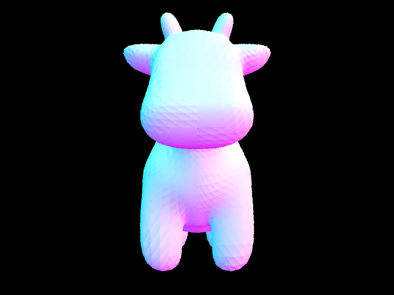
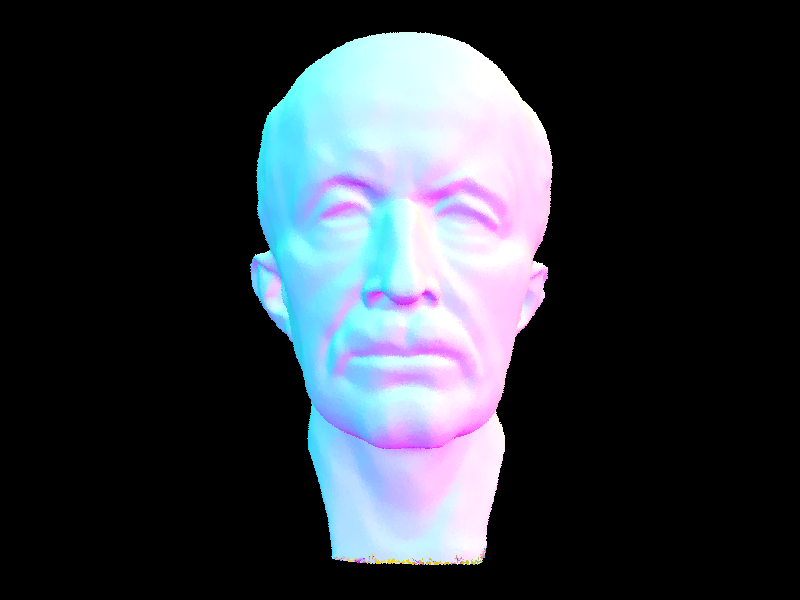
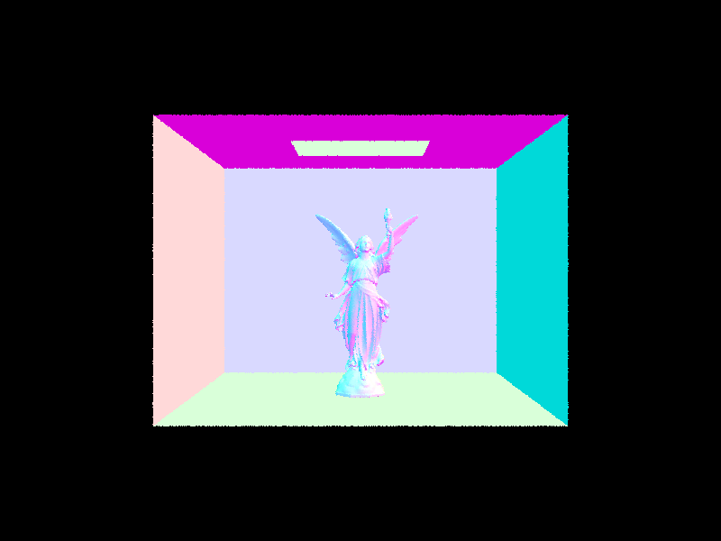
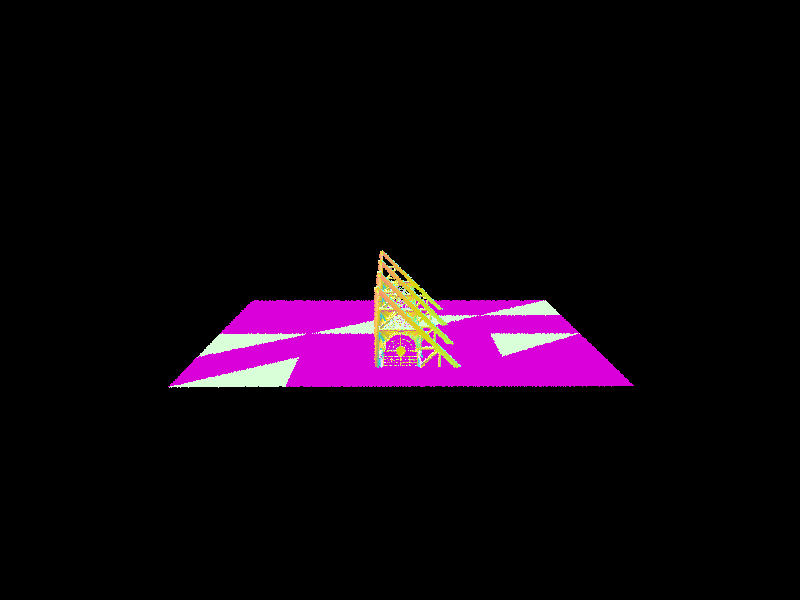

To communicate the impact of BVH on rendering times, we perform A/B testing on a few moderately complex geometry scenes and compare rendering stats. 

| Geometry file      | Without BVH | With BVH | Difference |
| ----------- | ----------- | ----------- |----------- |
| cow.dae      | (47.6920 seconds, 469993 rays traced, 2386.484205 intersection tests per ray)      | (0.6089 seconds, 471133 rays traced, 23.980791 intersection tests per ray)      | (240x speedup, 100x fewer intersection tests per ray)      |
| maxplanch.dae   | (553.8451 seconds, 454831 rays traced, 24826.189824 intersection tests per ray)       | (1.1775 seconds, 475518 rays traced,  40.440957 intersection tests per ray)       | (470x speedup, 620x fewer intersection tests per ray) |

From the above experiment where we compare statistics on geometries rendered without and with BVH acceleration, we see that BVH results in a >240x speedup in rendering time for `cow.dae` and a >470x speedup in rendering time for `maxplanch.dae`. We achieve these results by pruning nodes whose bounding box does not intersect with the traced ray. Thus, we performed 100x fewer primitive intersection tests per ray for `cow.dae` and 620x fewer primitive intersection tests per ray for `maxplanch.dae`. In lecture, we derived that primitive intersection tests are computationally expensive (even with our applied optimizations). Through BVH acceleration, we can make significantly fewer primitive intersection tests and therefore cut runtime by orders of magnitude.

## Part 3: Direct Illumination
In part 3, we contributed two implementations for direct illumination: direct lighting with uniform hemisphere sampling and direct lighting by importance sampling of lights. Both implementations used Monte Carlo estimation to approximate the respective integrals, so each function contained a sampling loop. 

### Direct lighting with uniform hemisphere sampling
First, we ensure that there’s a running sum for our Monte Carlo estimator. In this case, the skeleton provides it for us––denoted with `L_out`. Then, for each iteration in our sampling loop, 
1. We sampled the direction to draw from in the unit hemisphere (i.e., using `hemisphereSampler.get_sample()`). 
2. Then, we compute the denominator of the [reflection equation estimate](https://cs184.eecs.berkeley.edu/sp22/lecture/13-23/global-illumination-and-path-tra) using `1 / 2 * pi`. This value represents our unbiased proposal distribution, `p(w_i)`, a uniform distribution over the unit hemisphere. 
3. If the resulting sampled ray intersects with a light source, we’ll add its resulting contribution to the Monte Carlo running sum. The contribution is computed according to the reflection equation referenced above. 
4. Finally, after `num_samples` iterations, we can return the average of `L_out` as our direct lighting estimate. 

### Direct lighting with importance sampling
The setup for this implementation is similar to the setup for `estimate_direct_lighting_hemisphere`. This time, however, we want to sample over incident light directions, `w_j`, rather than using uniform hemisphere sampling. Thus, the main difference in our implementation is just the way that we sample the incoming ray direction, and the resulting normalization factor in the Monte Carlo estimate.

**Sampling procedure** 
For each light in the scene:
Take `ns_area_light` samples in the direction of the light:
Sample an incoming ray direction in the range of directions for that light
Cast a “shadow ray” from the hit point towards the light to see if there is anything blocking the light. Also, check if the sampled light is actually behind the surface, which happens if the cosine between the surface normal and the incoming direction is negative.
If either of these is true, we ignore the contribution of this sample
As an optimization, if the light being sampled is a point light, we can simply take a single sample and multiply the resulting contribution by `ns_area_light`.

**Normalization factor** 
Previously, we used a uniform distribution over the unit hemisphere for our estimate. Here, we instead use a distribution that focuses on directions of light sources (which are the only contributors to one-bounce radiance).

We can think of our new distribution as a uniformly weighted mixture over the distributions for each light. If there are `N` light sources total, which have sampling distributions of `p_1`, `p_2`, …, `p_N` respectively, then the distribution we are using is:

`1/N * p_1 + 1/N * p_2 + … + 1/N * p_N`

Thus, for each sample `x` that we take involving light source `i`, the normalization factor for the Monte Carlo estimate should be `1/N * p_i(x)`.

In our implementation, we don’t actually sample from this mixture distribution over lights, and instead deterministically take `ns_area_light` samples from each of the `N` light sources as suggested by the spec. However, this is the same in expectation as taking `N * ns_area_light` samples from the mixture distribution.

**Example images** 
| Uniform hemisphere sampling | Importance sampling of lights |
| --------- | --------- |
| 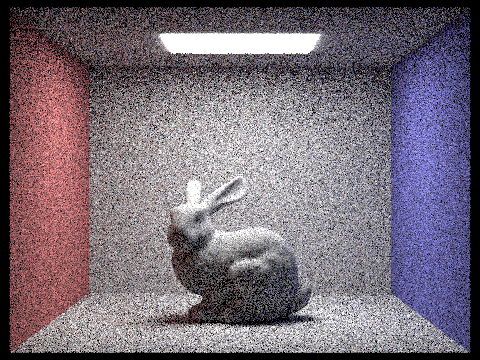 |  |
| 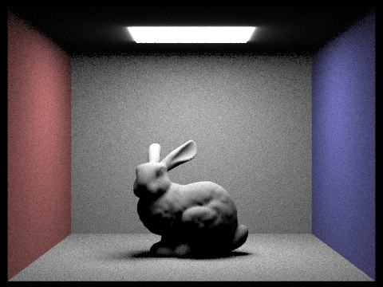 |  |
|  | 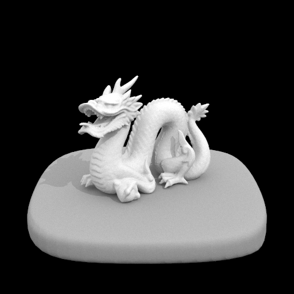 |

**Analysis of uniform hemisphere sampling vs. lighting sampling** 

As we see above, uniform hemisphere sampling generally results in “noisier” renders compared to importance sampling with the same number of light rays and samples per pixel. This makes sense because uniform sampling will sample many directions which do not intersect with a light source and thus contribute nothing to the overall estimate, whereas importance sampling of lights specifically focuses on directions which could affect the estimate.

Also, when there are no area lights in the scene, uniform hemisphere sampling is not able to render anything, because it is very rare for a uniformly random sampled direction to point in the direction of a point light (like in the dragon image).

**Effects of varying # of light rays** 
Below, we render CBbunny.dae with 1 sample per pixel and a varying number of light rays sampled per area light. Increasing the number of light rays helps make the render significantly smoother.

| 1 sample per area light | 4 samples per area light |
| --------- | --------- |
| 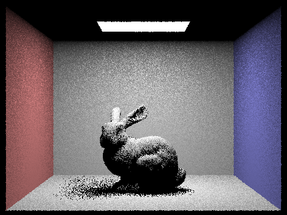 | 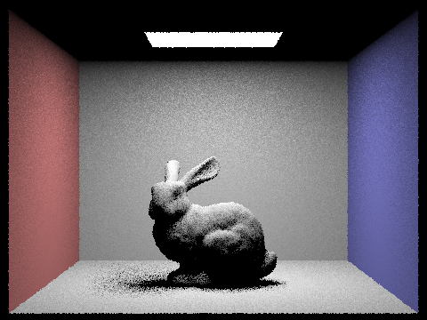 |

| 16 samples per area light | 64 samples per area light |
| --------- | --------- |
|  |  |

## Part 4: Global Illumination
With global illumination, we need to take into account incoming radiance from non-light sources as well, which comes from two or more bounces (unlike Part 3, which only considered zero and one bounce radiance).

To do this, we replaced the one bounce radiance component of `est_radiance_global_illumination` with `at_least_one_bounce_radiance`. This function does the following things:

- Compute the one bounce radiance
- Sample a new direction, then trace the ray from the original hit point in that direction to see where it intersects another surface (if any)
- If it does hit a surface, then from that new intersection point, recurisvely compute `at_least_one_bounce_radiance` and add that to the overall estimate

Although ideally global illumination would take into account infinitely many bounces of light, in order to make computation feasible, we do two things:
- First, we do global illumination with a `max_ray_depth`. We do not consider lighting effects beyond this number of bounces.
- Additionally, we use "Russian Roulette", which terminates the recursion early with some probability (we chose `0.35`) at each call. As we saw in lecture, this allows us to do our estimation with a finite number of steps, while still being unbiased.

Below are some examples images rendered with global illumination. We used 1024 samples per pixel, 16 light rays, and a max depth of 5.

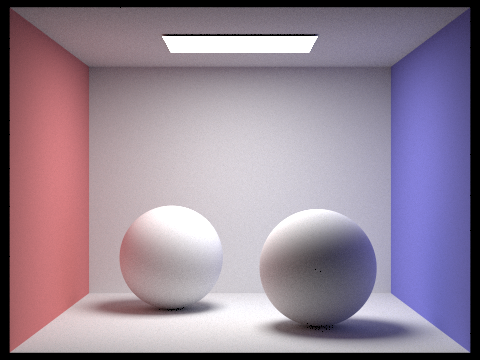
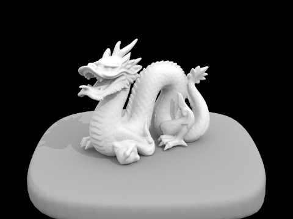

We can also see the contributions of direct illumination and indirect illumination to the overall image:

| Direct illumination only (0 and 1 bounce)      | Indirect illumination only (2+ bounces) |
| ----------- | ----------- |
| 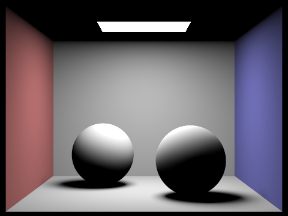      | 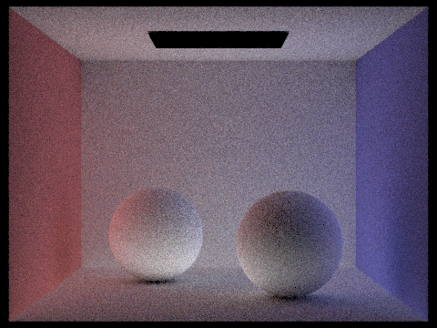       |

### Effects of varying `max_ray_depth`
Increasing the max ray depth helps improve our approximation of global illumination, making the rendered image brighter. However, we also see diminishing returns from depth — between depth 3 and depth 100, there is only a very tiny difference in lighting.

| Depth 0     | Depth 1     |
| ----------- | ----------- |
| 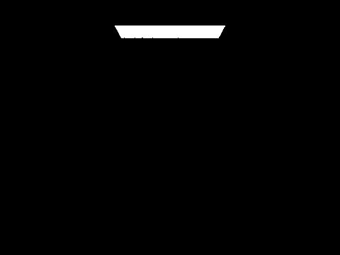      |        |

| Depth 2     | Depth 3     |
| ----------- | ----------- |
| 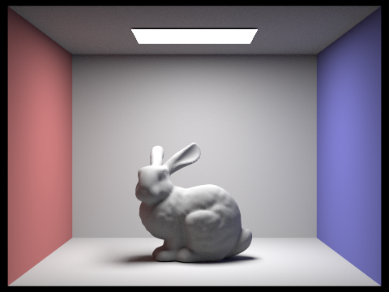      | 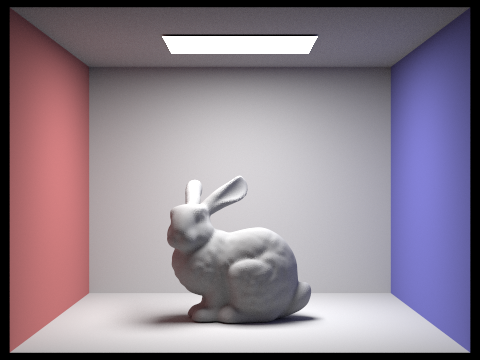       |

| Depth 100    ||
| ----------- | ----------- |
| 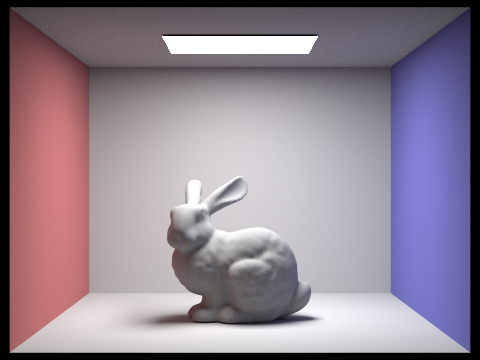 | |

### Effects of varying samples per pixel
Increasing the sample-per-pixel rate helps reduce the graininess of the rendered image:

| 1 sample per pixel     | 2 samples per pixel     |
| ----------- | ----------- |
| 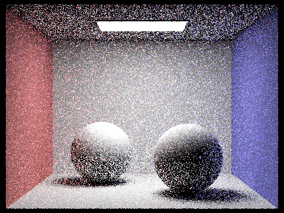      | 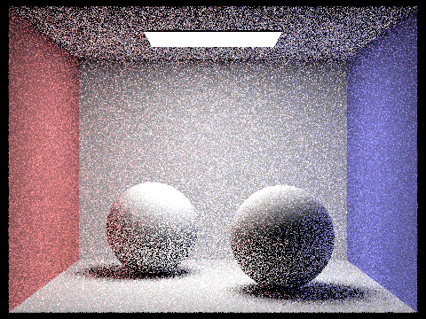       |

| 4 samples per pixel     | 8 samples per pixel     |
| ----------- | ----------- |
| 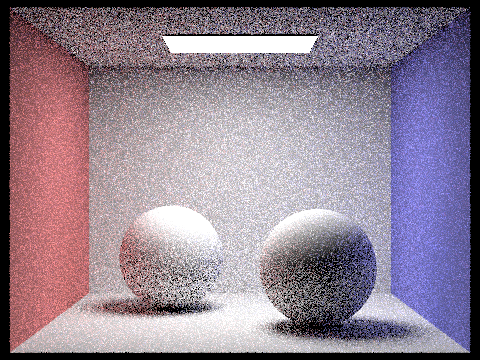      |        |

| 16 samples per pixel     | 64 samples per pixel     |
| ----------- | ----------- |
|       |        |

| 1024 samples per pixel     | |
| ----------- | ----------- |
| 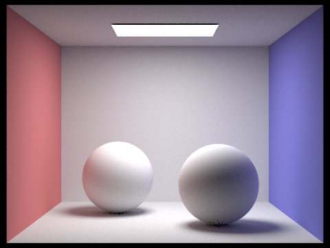      |       |

## Part 5: Adapative Sampling

To perform adaptive sampling, we modify our `Pathtracer::raytrace_pixel(..)` implementation as follows: 
1. We keep track of both a running sum and running squared sum, denoted by variable names `s1` and `s2`, respectively. 
2. At every iteration, we compute the sample’s illuminance by calling `radiance.illum()`, where `radiance` is our estimate from Task 3 and 4. Then, we update `s1` and `s2` and continue with our uniform sampling algorithm from Task 1.2. 
3. After every `samplesPerBatch` samples, we compute the mean, variance, and measure of pixel convergence ([source](https://cs184.eecs.berkeley.edu/sp22/docs/proj3-1-part-5)). If our measure of pixel convergence is less than or equal to `maxTolerance * mean`, we can halt our sampling algorithm, update the sample buffer with our average, update the count buffer with the number of samples we performed, then return. 

Depicted below is the bunny scene with `2048` samples per pixel. Here, we use 1 sample per light and 5 for max ray depth. Take special notice of the sample rate image (right), which shows how adaptive sampling changes depending on which part of the image we are rendering.

| Noise-free Rendered Image      | Sample Rate Image |
| ----------- | ----------- |
|       | 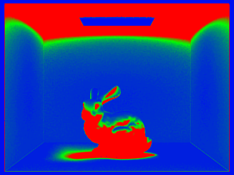       |

### Note on collaboration

Kevin Li and Micah Yong collaborated on the path tracing project together. 
- How we collaborated: For every part, one person was a lead (driver) and one person was a watcher (passenger). Leads were responsible for performing most of the initial research, coding implementation, and pull request. Passengers were responsible for assisting in pair-programming sessions, providing supplemental research and insights for the problem, and carefully reviewing the lead’s code.  
- How it went: We found that this system works very well for completing most tasks, as ownership and responsibilities were clearly delineated from the onset. However, for highly complex tasks or debugging sessions, the “roles” faded away and we needed to be highly collaborative throughout the entire process. This was especially the case for tasks like Project 2.5 and Project 3.1.2. 
- What we learned: With regards to collaboration, we learned how to communicate our thoughts clearly to one another and give constructive feedback during code reviews. This collaboration gives us a taste of what working with colleagues on challenging problems would be like in the real world. 
