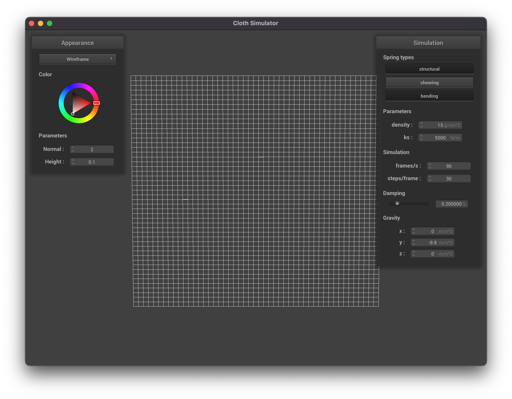

# Project 4: Cloth Sim

**Contributors**: Micah Yong (micahtyong@berkeley.edu) and Kevin Li (kevintli@berkeley.edu)

## Overview

In this project, we implemented a real-time cloth simulation using a mass and spring-based system. We implemented the exact physical constraints on each point mass and spring, then applied numerical integration to simulate the way the cloth moves over time. We implemented collisions with other objects as well as handling for self-collisions. We learned advanced techniques such as the 10% rule to define deformation constraints and Verlet integration to estimate cloth movement efficiently. 

## Part 1: Masses and Springs

To communicate our results for part 1, we portray the following screenshots of `scene/pinned2.json` to show the structure of our masses and springs. 

| Experiment description      | Result |
| ----------- | ----------- |
| Without any shearing constraints      |        |
| With only shearing constraints      |        |
| Without all constraints applied     |        |

## Part 2: Simulation via Numerical Integration 

In the following experiment, we describe how individual parameters affect the end result of the cloth simulation. 

**Varying the spring constant, `ks`**
 
- With a very low `ks` (e.g., 10 N/m), the cloth is very loose with little spring force to maintain its original square layout. The top section appears to be stretched out. 
- With a very high `ks` (e.g., 99999 N/m), the cloth is held tightly by the two pins with ample spring force to maintain its original square layout. The top section appears to be much tighter than the first experiment.

| Low `ks`: `10 N/m`      | High `ks`: `99999 N/m` |
| ----------- | ----------- |
|       |        |

**Varying the density constant, `density`**

- With a very low `density` (e.g., 0.1 g/cm^2), the cloth is very tight and light, making it much easier for a small amount of spring force (e.g., 1000 N/m) to maintain its original square layout. The cloth’s behavior reminded me of a thin handkerchief. 
- With a very high `density` (e.g., 10000 g/cm^2), the cloth is very stretched and heavy, making it much more difficult for the same amount of spring force (e.g., the default 1000 N/m) to maintain its original shape. For example, the top section appears to be stretched out. The cloth’s behavior reminded me of thick rope. 

| Low `density`: `0.1 g/cm^2`      | High `density`: `10000 g/cm^2` |
| ----------- | ----------- |
|       |        |

**Varying the damping constant**

- With a very low `damping` (e.g.,`0%`), the cloth infinitely remains in motion. In particular, the cloth swings back and forth due to the spring force and gravity, with its effects remaining the same overtime. Without knowing the parameters of this simulation, one might think that there’s a constant wind force in the environment. 
- With a very high `damping` (e.g.,`1%`), the cloth is incredibly stiff. In particular, the cloth falls in slow motion and reaches a stand-still as soon as the cloth reaches its resting position the first time (i.e., without the need to swing back and forth to slow down). The cloth’s behavior reminded me of a thick sheet of foam.

| Low `damping`: `0%` (after 1 second)      | High `damping`: `1%` (after 1 second) |
| ----------- | ----------- |
|       |        |

## Part 3: Handling collisions with other objects

**sphere.json**

The following table portrays our results from a cloth falling onto a sphere. We vary the spring force constant, `ks`, and write down our observations. 

| Experiment description      | "Final" resting state | Observations |
| ----------- | ----------- | ----------- |
| Set `ks = 5000` (baseline) |  | The cloth rests on the sphere as expected. We will use this image as a baseline for the following two experiments. |
| Set `ks = 500` |  | The cloth appears to be much more loose (more drape-y) when resting on the sphere, compared to the baseline experiment of `ks = 5000`. |
| Set `ks = 50000` |  | The cloth appears to be much more stiff when resting on the sphere, compared to the baseline experiment of `ks = 5000`. |

The true final resting state of all of our experiments is merely the sphere itself, since the cloth falls off after some time. 

**plane.json**

The following table portrays our results from a cloth falling onto a plane. We chose to use a pink-ish white color to celebrate the fading cherry blossom season. We also show the same resting result with the default normal color. 

| Resting position, custom wireframe      | Resting position, default coloring |
| ----------- | ----------- |
|       |        |

<table with two rows and two columns>
Resting position: Custom wireframe
Resting position: Default coloring

## Task 4: 